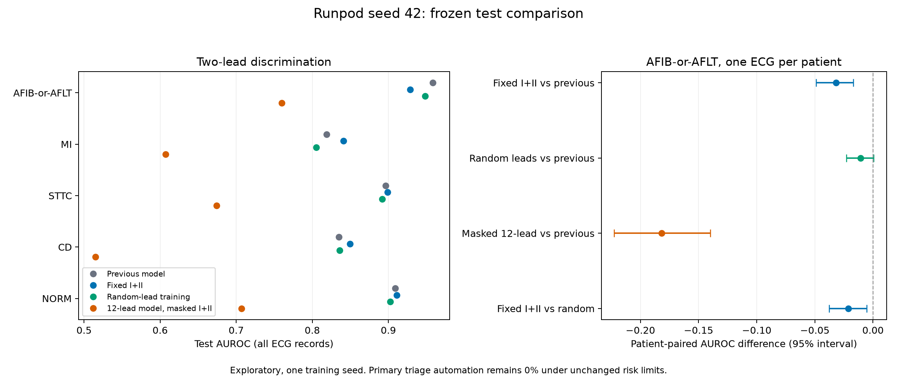

# Runpod seed-42 comparison

All three new models completed 50 epochs. Best checkpoints, label schemas, validation-log selection scores, and local waveform fingerprints were verified. All new validation policies were frozen before exporting the new test predictions. Risk limits were unchanged.

Comparisons use 2,198 test ECGs for descriptive model metrics and 1,904 protocol-selected patient ECGs for primary policy metrics. These are exploratory results on an already inspected cohort, with one training seed.

## Main findings

- Fixed I+II improves the two-lead superclass macro-AUROC from 0.8586 to 0.8673, with improvements for MI (0.8190 to 0.8409) and CD (0.8351 to 0.8496). These are descriptive, single-seed gains.
- AFIB-or-AFLT ranking regresses: previous 0.9582, fixed I+II 0.9287, new random-lead model 0.9483. The patient-paired interval for fixed I+II versus the previous model excludes zero, but does not account for training-seed variation.
- The new random-lead model slightly improves AFIB-or-AFLT average precision (0.6690 to 0.6799) and calibrated patient-level Brier error (0.0338 to 0.0309), despite lower AUROC.
- No approach achieves nonzero automation for the primary conditional-error endpoint. The best validation negative-error upper bounds are 2.60% for fixed I+II, 2.40% for random-lead training and 3.35% for full-lead rescue, above the 2% limit.
- Among the 29 eligible diagnosis policies, the previous patient-level run automated at least some cases for three targets (PACE, CRBBB, STACH). The two new reduced-lead approaches do so only for PACE; the masked twelve-lead approach does so for none. This is a per-diagnosis count, not patient-wide automation.
- The new full-lead rescue model also regresses in superclass macro-AUROC: 0.9128 to 0.8954. Merely masking this model is a poor reduced-lead strategy.
- Overall: useful diagnosis-specific improvements, but no broad improvement and no improvement in the primary triage endpoint. Keep the historical model as a reference, not as an independently calibrated deployment candidate.

## Two-lead AFIB-or-AFLT discrimination

Raw-score AUROC and average precision assess ranking. Brier assesses raw probability error (lower is better).

| Approach | AUROC | Average precision | Raw Brier |
|---|---:|---:|---:|
| Previous model, patient analysis | 0.9582 | 0.6690 | 0.0378 |
| Fixed I+II | 0.9287 | 0.5870 | 0.0430 |
| Random lead training | 0.9483 | 0.6799 | 0.0377 |
| Twelve-lead model masked to I+II | 0.7599 | 0.2174 | 0.0994 |

## Primary frozen triage policy

All new approaches use the same newly trained fixed twelve-lead model for rescue. The previous model uses its historical twelve-lead predictions.

| Approach | Automated | Twelve-lead acquisition | Expert referral | Accepted negatives | Wrong negatives | Negative error upper 95% |
|---|---:|---:|---:|---:|---:|---:|
| Previous model, patient analysis | 0.00% | 100.00% | 100.00% | 0 | 0 | Undefined |
| Fixed I+II | 0.00% | 100.00% | 100.00% | 0 | 0 | Undefined |
| Random lead training | 0.00% | 100.00% | 100.00% | 0 | 0 | Undefined |
| Twelve-lead model masked to I+II | 0.00% | 100.00% | 100.00% | 0 | 0 | Undefined |

Zero accepted predictions means no demonstrated automation, not zero conditional error. Test intervals are descriptive and do not select or modify policies.

## Key diagnosis AUROCs with I+II

| Approach | AFIB-or-AFLT | MI | STTC | CD | NORM (superclass) |
|---|---:|---:|---:|---:|---:|
| Previous model, patient analysis | 0.9582 | 0.8190 | 0.8962 | 0.8351 | 0.9089 |
| Fixed I+II | 0.9287 | 0.8409 | 0.8991 | 0.8496 | 0.9112 |
| Random lead training | 0.9483 | 0.8053 | 0.8918 | 0.8359 | 0.9023 |
| Twelve-lead model masked to I+II | 0.7599 | 0.6073 | 0.6740 | 0.5149 | 0.7070 |

## Broad model performance

Unweighted diagnosis macro means; rare-label estimates are unstable and these are descriptive comparisons.

| Approach | Lead set | Superclass AUROC | Subcode AUROC | Rhythm AUROC (includes composite) |
|---|---|---:|---:|---:|
| Previous model, patient analysis | 12-lead | 0.9128 | 0.8774 | 0.9148 |
| Previous model, patient analysis | 2-lead | 0.8586 | 0.8246 | 0.8921 |
| Fixed I+II | 12-lead | 0.8954 | 0.8440 | 0.8667 |
| Fixed I+II | 2-lead | 0.8673 | 0.8268 | 0.8784 |
| Random lead training | 12-lead | 0.8954 | 0.8440 | 0.8667 |
| Random lead training | 2-lead | 0.8516 | 0.8209 | 0.8940 |
| Twelve-lead model masked to I+II | 12-lead | 0.8954 | 0.8440 | 0.8667 |
| Twelve-lead model masked to I+II | 2-lead | 0.6409 | 0.6447 | 0.7655 |

## Patient-paired primary AUROC contrasts

One ECG per patient, 2,000 paired bootstrap replicates, descriptive percentile intervals. These do not include training-seed variability or multiplicity correction.

| Approach | Reference | AUROC difference | 95% interval |
|---|---|---:|---:|
| Fixed I+II | Previous model, patient analysis | -0.0319 | [-0.0490, -0.0168] |
| Random lead training | Previous model, patient analysis | -0.0106 | [-0.0230, +0.0006] |
| Twelve-lead model masked to I+II | Previous model, patient analysis | -0.1819 | [-0.2225, -0.1399] |
| Fixed I+II | Random lead training | -0.0213 | [-0.0378, -0.0053] |

## Frozen calibration on patient representatives

| Approach | Raw Brier | Calibrated Brier |
|---|---:|---:|
| Previous model, patient analysis | 0.0335 | 0.0338 |
| Fixed I+II | 0.0380 | 0.0381 |
| Random lead training | 0.0322 | 0.0309 |
| Twelve-lead model masked to I+II | 0.0949 | 0.0540 |

## Separate conformal sensitivity

This is standalone-model unconditional patient any-error risk, not conditional error among accepted predictions and not the two-stage policy. The historical checkpoint lacks independent calibration, so its conformal calculation is nominal only.

| Approach | Lead set | Record coverage | Patient any-error rate | Independent calibration |
|---|---|---:|---:|---|
| Previous model, patient analysis | 12-lead | 94.72% | 2.26% | False |
| Previous model, patient analysis | 2-lead | 90.99% | 2.10% | False |
| Fixed I+II | 12-lead | 84.39% | 2.00% | True |
| Fixed I+II | 2-lead | 87.76% | 2.05% | True |
| Random lead training | 12-lead | 84.39% | 2.00% | True |
| Random lead training | 2-lead | 90.99% | 2.00% | True |
| Twelve-lead model masked to I+II | 12-lead | 84.39% | 2.00% | True |
| Twelve-lead model masked to I+II | 2-lead | 57.28% | 2.15% | True |

## Interpretation boundaries and next steps

- The historical and new experiments differ in development split, checkpoint selection, auxiliary loss and training; their differences cannot be attributed to one change alone.
- Fixed I+II versus the new random-lead model is the closest matched training comparison: same data, architecture, seed, objective and selection lead.
- The masked twelve-lead baseline was selected on twelve-lead performance, whereas two-lead models were selected on two-lead performance.
- Retain the frozen limits and all results, including zero coverage. Do not choose new thresholds using test results.
- Repeat the already specified comparison with seeds 43 and 44 and use an untouched external cohort for confirmation.
- Per-target metrics, calibration, subgroup and repeat-ECG sensitivity tables are included as companion CSV files. Sparse subgroup results are descriptive, not subgroup safety guarantees.

## Subgroup and repeat-record checks

Age/sex and signal-quality tables are in `subgroup_comparison.csv`; repeat-record analyses are in `repeat_ecg_comparison.csv`. For AFIB-or-AFLT in patients aged 80+, AUROC is 0.8824 previously, 0.8277 for fixed I+II and 0.8595 for random-lead training (340 ECGs, 71 positive records). These are descriptive subgroup results. The under-40 group has only one positive record, so its apparent AUROC differences are not reliable.

Twelve-lead rows under each new approach refer to the same shared fixed12 rescue model, not to the fixed-I+II model receiving twelve leads. The conformal CSV includes exact descriptive patient-error intervals; point estimates near 2% must not be interpreted as certain satisfaction of that limit.
